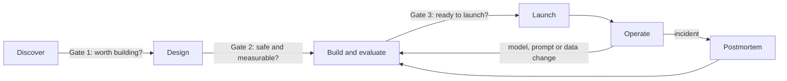

# AI Delivery Playbook

Templates and decision gates for taking an AI feature from idea to production and
keeping it healthy there. Written for engineering managers, tech leads and product
managers who need AI features to ship **and** hold up: measurably good, affordable, and
safe to be wrong.

Every template has been applied end to end in a [worked example](examples/handbook-assistant/)
for a real, open-source project:
[production-rag-service](https://github.com/tsriharsha402/production-rag-service).

## Why AI features need their own playbook

Standard delivery practice assumes software is deterministic and fails loudly. AI
features break both assumptions:

| Traditional software | AI features |
|---|---|
| Same input, same output | Same input, different outputs; quality is a distribution |
| Bugs crash or error | Failures look like confident, fluent, wrong answers |
| Correctness is checked by tests | Quality is estimated by evaluations on a sample |
| Dependencies change when you upgrade | A model or prompt change can shift behavior everywhere at once |
| Cost scales with infrastructure | Cost scales with every request, and with how much the model "thinks" |

## Principles

1. **No eval, no launch.** If quality can't be measured, it can't be shipped, compared or improved.
2. **Decide the bar before you measure.** Thresholds and decision rules are written before results exist.
3. **Cost is a feature.** Cost per task is estimated at design time and tracked from the first prototype.
4. **Design for being wrong.** Every AI feature needs a way for users to verify, a way to say "I don't know", and a way to roll back.
5. **People own outcomes.** A named owner answers for each AI feature's quality, cost and incidents.

## Lifecycle

| Phase | Question | Template | Gate owner |
|---|---|---|---|
| **Discover** | Is this worth building, and does it need AI? | [AI feature brief](templates/01-ai-feature-brief.md) | Product + engineering lead |
| **Design** | How will we know it's good? What can go wrong? | [Evaluation plan](templates/02-evaluation-plan.md), [Risk assessment](templates/03-risk-assessment.md), [Model selection rubric](templates/04-model-selection-rubric.md) | Engineering lead + risk reviewer |
| **Build and evaluate** | Does it meet the bar we set? | [Decision record](templates/05-decision-record.md), [AI change review](templates/06-ai-change-review.md) | Tech lead |
| **Launch** | Are we ready for real users? | [Launch readiness checklist](templates/07-launch-readiness.md) | Engineering manager |
| **Operate** | Is it still good, affordable and safe? | [Monitoring plan](templates/08-monitoring-plan.md), [AI incident postmortem](templates/09-incident-postmortem.md) | Feature owner |

## Right-size the process: risk tiers

Not every AI feature needs every document. Classify the feature first, in the brief:

| Tier | Examples | Required |
|---|---|---|
| **1: Internal, assistive** | Internal Q&A, drafting help, code suggestions a person reviews | Brief, evaluation plan, launch checklist |
| **2: Customer-facing** | Support assistant, product search, generated content users see | Tier 1 + risk assessment, monitoring plan, staged rollout |
| **3: High-stakes** | Anything influencing hiring, credit, health, legal or safety outcomes | Tier 2 + legal and ethics review, mandatory human decision-maker, external audit trail |

When in doubt, choose the higher tier. Moving down later is cheap; an under-reviewed
high-stakes feature is not.

## How to use it

1. Copy the templates you need into your repository, e.g. `docs/ai/<feature-name>/`.
2. Fill them in as pull requests, so every decision has a review and a history.
3. Link each gate's sign-off (PR approval, meeting notes) from the document itself.
4. Revisit the evaluation plan and monitoring plan whenever the model, prompt or data
   changes; use the [AI change review](templates/06-ai-change-review.md) for that.

Proposing a new AI feature? Open an issue with the
[AI feature proposal](.github/ISSUE_TEMPLATE/ai-feature-proposal.yml) form.

## Worked example

[Handbook Assistant](examples/handbook-assistant/): an internal Q&A assistant over
company policy documents (Tier 1), taken through every template with real numbers from
its evaluation suite and its [model selection benchmark](https://github.com/tsriharsha402/llm-model-selection).

## License

[CC BY 4.0](LICENSE): use and adapt freely, with attribution.
